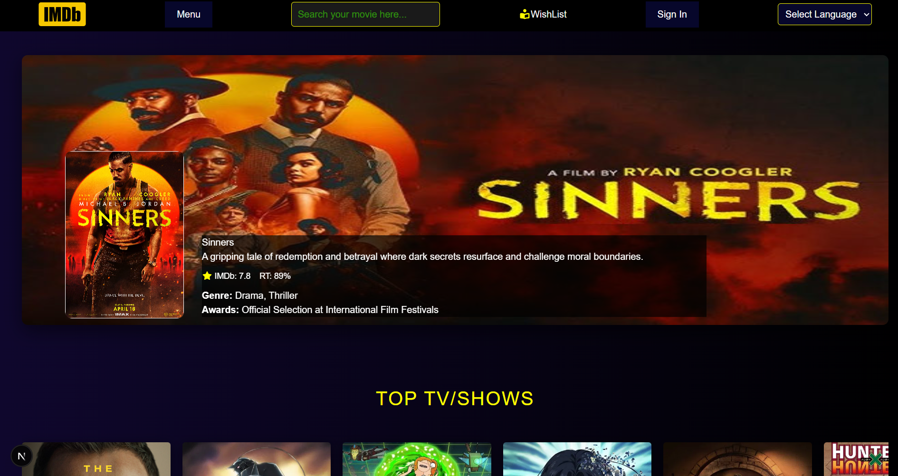
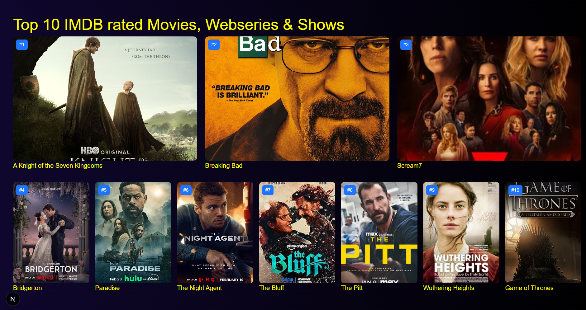
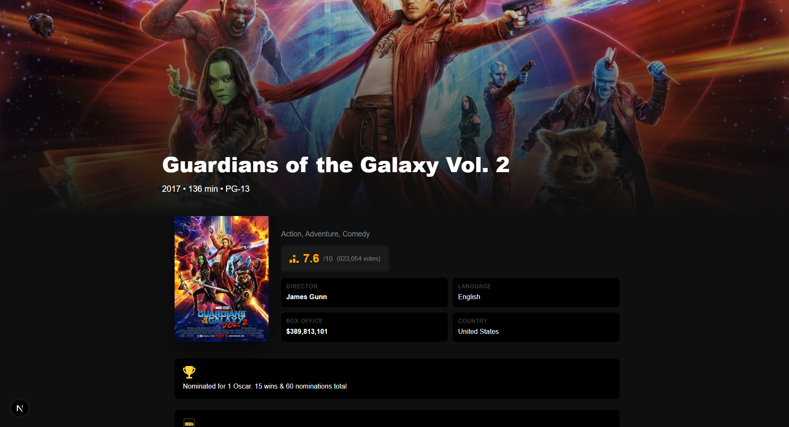

# Movie Search Web App

A simple movie search web application built using **Next.js** and the **OMDb API,TMDB API**.
Users can search for movies and view detailed information including ratings, genre, and runtime.

---

##  Features

*    **Movie Search**

  * Users can search any movie using the search bar.
  * Fetches data from the **OMDb API**.

*  **Movie Details Page**

  * Displays detailed information about the selected movie.
  * Includes:

    * Movie poster
    * Title
    * Year
    * Runtime
    * Rating
    * Genre
    * Plot summary

* **Backdrop Section**

  * Movie poster displayed as a large header background.
  * Gradient overlay for better readability.

* **Ratings Display**

  * IMDb rating
  * Rotten Tomatoes rating (if available)

*  **Responsive Layout**

  * Works on different screen sizes.

---

## Tech Stack

* **Next.js**
* **React**
* **JavaScript**
* **OMDb API**
* **CSS**

---
## Installation
1. Clone  repo
```
git clone <your-repository-link>
```
2. Install dependency.
```
npm install / npm i
```
3. Create a `.env.local` file
```
MOVIEAPI_KEY=your_omdb_api_key
TMDB_KEY=yourkey
NEXT_PUBLIC_TMDB_KEY=your key  //next and TmDB key = same
GEMINI_KEY=yourkey
GROQ_KEY=yourkey
```
4. Run server by
```
npm run dev
```
Open in browser:
```
http://localhost:3000
```
---
## Screenshots
### Home Page

### Movie Details Page

### Search Result

---
## Some Limits
* Some ratings may not appear if the API does not return them.
* No database storage (data fetched only from API).
* some movies section is currently static.
---


