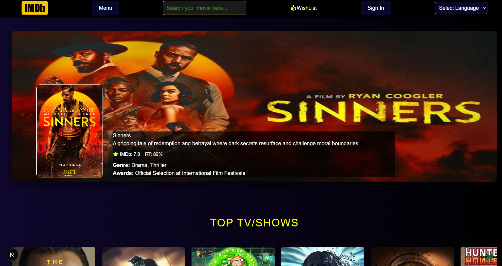
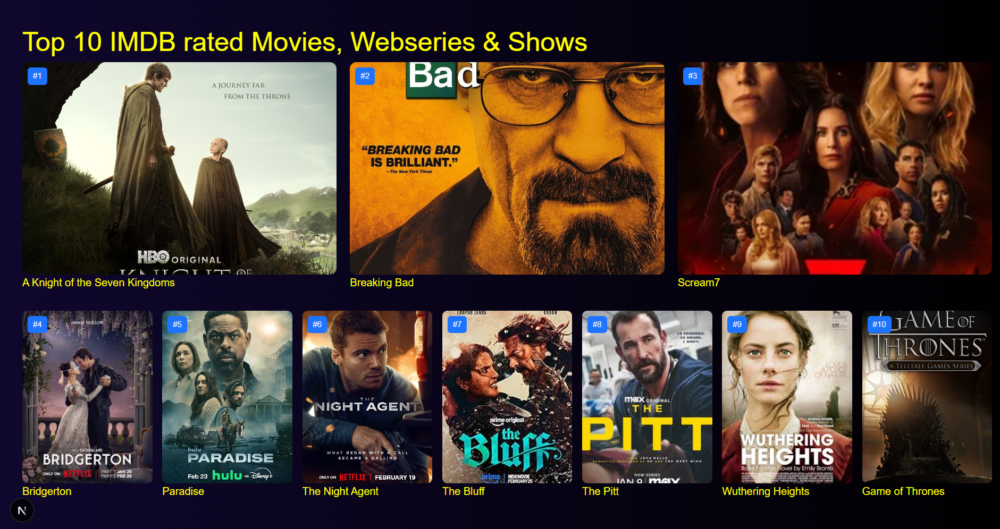
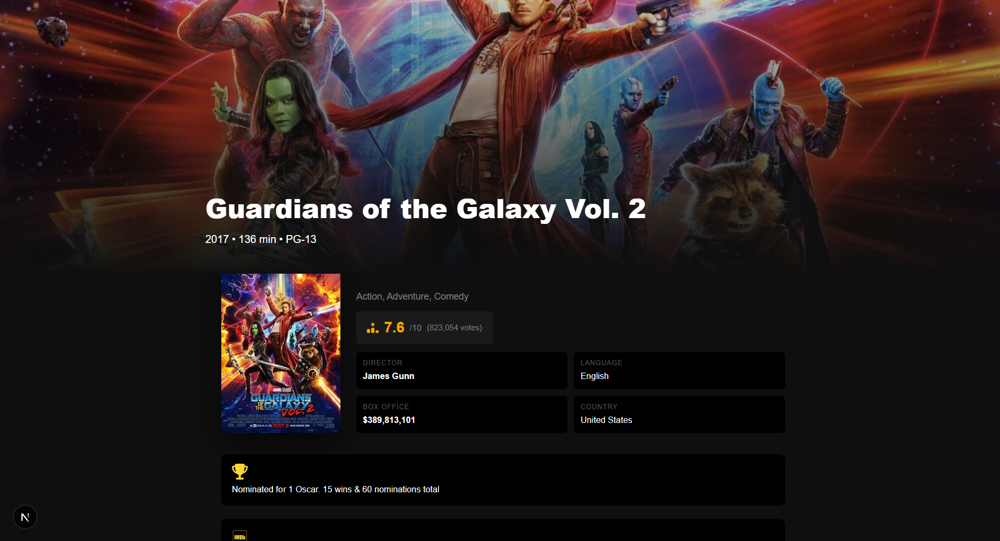

# Movie Search Web App (Website + Dashboard)

A simple movie search web application built using **Next.js** and the **OMDb API,TMDB API**.
Users can search for movies and view detailed information including ratings, genre, and runtime.

---

##  Features

*    **Movie Search**

  * Users can search any movie using the search bar.
  * Fetches data from the **OMDb API**.

*  **Movie Details Page**

  * Displays detailed information about the selected movie.
  * Includes:

    * Movie poster
    * Title
    * Year
    * Runtime
    * Rating
    * Genre
    * Plot summary

* **Backdrop Section**

  * Movie poster displayed as a large header background.
  * Gradient overlay for better readability.

* **Ratings Display**

  * IMDb rating
  * Rotten Tomatoes rating (if available)

*  **Responsive Layout**

  * Works on different screen sizes.

---

## Tech Stack

* **Next.js**
* **React**
* **JavaScript**
* **OMDb API**
* **CSS**

---
## Installation
1. Clone  repo
```
git clone <your-repository-link>
```
2. Install dependency.
```
npm install / npm i
```
3. Create a `.env.local` file
```
MOVIEAPI_KEY=your_omdb_api_key
TMDB_KEY=yourkey
NEXT_PUBLIC_TMDB_KEY=your key  //next and TmDB key = same
GEMINI_KEY=yourkey
GROQ_KEY=yourkey
```
4. Run server by
```
npm run dev
```
Open in browser:
```
http://localhost:3000
```
---
## Screenshots
### Home Page

### Movie Details Page

### Search Result

---
## Some Limits
* Some ratings may not appear if the API does not return them.
* No database storage (data fetched only from API).
* some movies section is currently static.
* Language option will take time to convert so wait for 10-15s or refresh if after 30s it not work.
---
# 📡 Analytics Backend Server

A lightweight **Node.js + Express** backend that ingests and serves user behavior events (clicks, page views, scrolls, etc.) stored in **MongoDB Atlas** via **Mongoose**.

---

##  Tech Stack

- **Node.js** — Runtime
- **Express** — HTTP server & routing
- **Mongoose** — MongoDB object modeling
- **MongoDB Atlas** — Cloud database (auto-creates collection on first write)
- **dotenv** — Environment variable management
- **cors** — Cross-origin request handling

---

##  Project Structure

```
backend/
├── server.js              # Entry point — Express app, DB connection, middleware
├── routes/
│   └── user_routes.js     # All 4 API route definitions
├── controller/
│   └── events.js          # Business logic for each route
├── model/
│   └── Event.js           # Mongoose schema definition
└── .env                   # Environment variables (not committed)
```

---

##  Database Schema — `Event` Model

Defined in `model/Event.js`. Every user interaction is stored as one document.

| Field | Type | Required | Description |
|---|---|---|---|
| `session_id` | String |  Yes | Groups all events from one browser session |
| `country` | String | No | Auto-filled via GeoIP lookup (default: `"Unknown"`) |
| `state` | String | No | Auto-filled via GeoIP lookup (default: `"Unknown"`) |
| `event_type` | String (enum) |  Yes | One of: `page_view`, `click`, `scroll`, `search`, `form_submit`, `add_to_cart`, `custom` |
| `page_url` | String |  Yes | Full URL where the event occurred (e.g. `http://localhost:3000/`) |
| `timestamp` | Date | No | Auto-set to current time on creation |
| `x` | Number | No | Mouse X coordinate — only present on `click` events |
| `y` | Number | No | Mouse Y coordinate — only present on `click` events |
| `metadata` | Map | No | Optional flexible key-value store for custom event data |

**Sample raw document in MongoDB Atlas:**

```json
{
  "_id": "6a36cfc31cad141ae580e0bb",
  "session_id": "session_u7hk77zo9_1781977018445",
  "country": "India",
  "state": "Madhya Pradesh",
  "event_type": "click",
  "page_url": "http://localhost:3000/",
  "timestamp": "2026-06-20T17:37:07.883Z",
  "x": 1470,
  "y": 434
}
```

> **Note on collections:** You do **not** need to manually create a collection in Atlas. Mongoose automatically creates a collection named **`events`** (lowercase plural of your model name `Event`) the first time a document is written.

---

##  API Routes

All routes are prefixed with `/api` (defined in `server.js` via `app.use("/api", require("./routes/user_routes"))`).

### 1. `POST /api/events`
**Purpose:** Ingest a new user interaction event.

**Request Body:**
```json
{
  "session_id": "session_abc123",
  "event_type": "click",
  "page_url": "http://localhost:3000/",
  "x": 540,
  "y": 210
}
```

**Response:** The saved document with its generated `_id` and `timestamp`.

---

### 2. `GET /api/sessions`
**Purpose:** Returns a list of all unique sessions with their total event count.

**Why `eventCount` is NOT in MongoDB:** Each raw document stores only one event. The total count is **calculated at runtime** using MongoDB's aggregation pipeline — it is never stored as a field.

**Aggregation logic in `controller/events.js`:**
```js
const getAllSess = async (req, res) => {
  const sessions = await Event.aggregate([
    {
      $group: {
        _id: "$session_id",
        eventCount: { $sum: 1 },   // counts all docs sharing this session_id
        country: { $first: "$country" }
      }
    }
  ]);
  res.status(200).json(sessions);
};
```

**Sample response from `http://localhost:5000/api/sessions`:**
```json
[
  {
    "_id": "session_u7hk77zo9_1781977018445",
    "eventCount": 8,
    "country": "India"
  }
]
```

---

### 3. `GET /api/sessions/:sessionId`
**Purpose:** Returns the full chronological event timeline for one specific session.

**Example:** `GET /api/sessions/session_u7hk77zo9_1781977018445`

**Response:** Array of all event documents sorted by `timestamp` for that session — useful for replaying a user's journey step by step.

---

### 4. `GET /api/heatmap`
**Purpose:** Returns all `click` events with `x`/`y` coordinates, filtered by `page_url`.

**Example:** `GET /api/heatmap?page=http://localhost:3000/`

**Response:** Array of `{ x, y }` objects used by the frontend heatmap grid to render click density zones per page.

---

##  Installation & Setup

### 1. Install dependencies

```bash
cd backend
npm install
```

### 2. Create `.env` file

```env
MONGO_URI=your_mongodb_atlas_connection_string
PORT=5000
```

> Get your `MONGO_URI` from MongoDB Atlas → Connect → Drivers → copy the connection string and replace `<password>` with your actual password.

### 3. Start the backend server

```bash
npm run dev
```

Server starts at: **`http://localhost:5000`**

---

## 🚀 Running the Full Stack

You need **two terminals open simultaneously:**

**Terminal A — Frontend (Next.js):**
```bash
npm run dev
# Runs at http://localhost:3000
```

**Terminal B — Backend (Express):**
```bash
cd backend
npm run dev
# Runs at http://localhost:5000
```

---

## ✅ Quick Verification

After starting both servers, open these URLs to confirm everything is working:

| URL | Expected Result |
|---|---|
| `http://localhost:3000` | Movie search app loads |
| `http://localhost:5000/api/sessions` | JSON array of session summaries with `eventCount` |
| `http://localhost:5000/api/heatmap?page=http://localhost:3000/` | JSON array of `{ x, y }` click points |

---

## ⚠️ Known Limitations

- `country` and `state` resolve as `"Anonymous"` / `"Unknown"` on localhost since `127.0.0.1` has no GeoIP data — they populate correctly in production.
- No authentication on API routes — intended for local/internal analytics use only.
- Heatmap coordinates are absolute pixel values and may shift if the browser window is resized.


